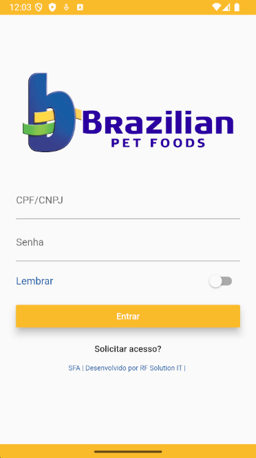
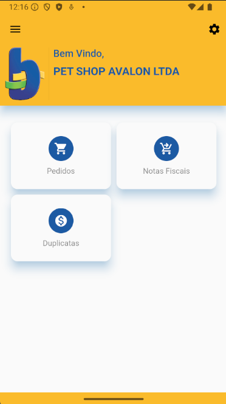
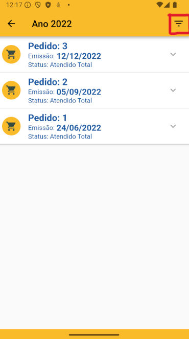
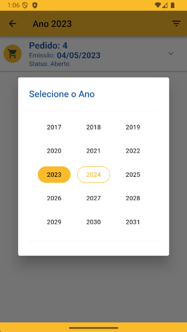
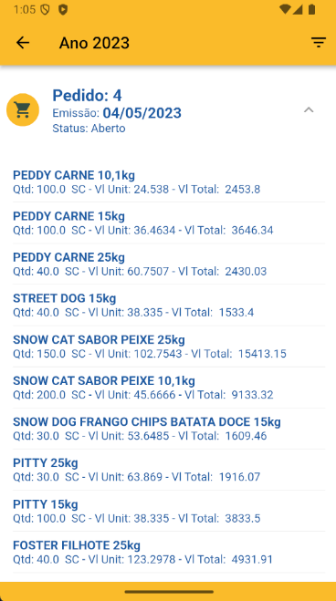
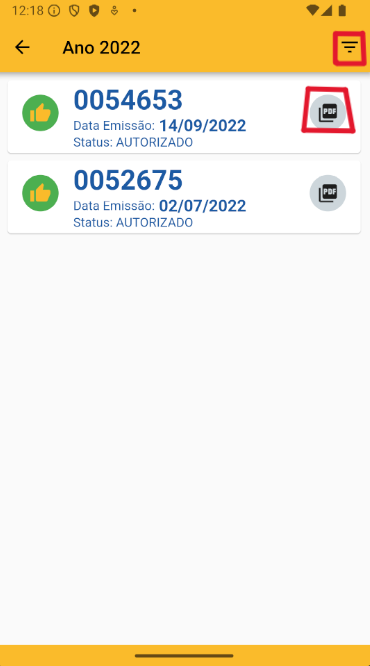
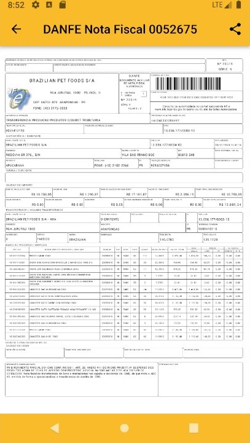
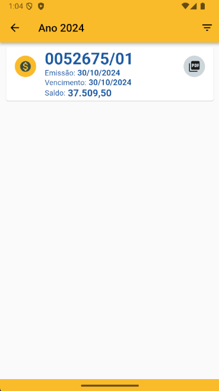
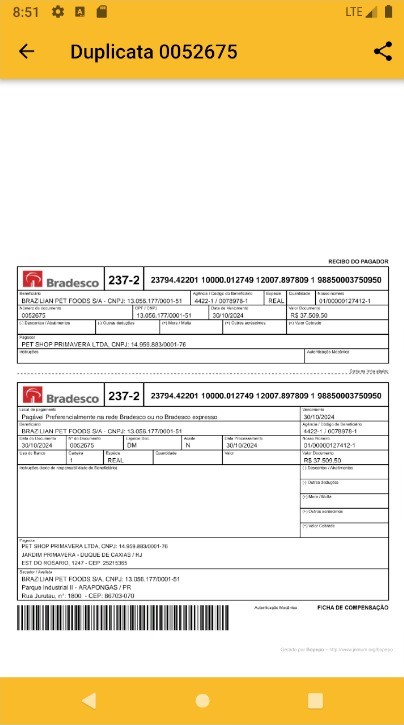

# Login

**Informações importantes**

* `CPF/CNPJ/Código de Vendedor:` Informar o login de acesso.
* `Senha:` Informar a senha de acesso;
* Caso o usuário ainda não tenha uma senha, ele deve clicar `Solicitar Acesso`
* Após clicar em `Solicitar Acesso`, deverá informar o `CPF/CNPJ` ou o `Código` que será enviado uma senha para o email do usuário cadastrado.

# Menu Inicial

**Abaixo as principais opções disponiveis no menu do cliente:**

* `Pedidos` - Neste botão será exibido a lista de pedidos do cliente.
* `Notas Fiscais` - Neste botão será exibido a lista de notas fiscais do cliente.
* `Duplicatas` - Neste botão será exibido a lista de duplicatas do cliente.

# Pedidos

**Funcionalidades da Pedidos:**

* `Filtro Período:` - Permite a seleção dos pedidos por data.

**Seleciona data desejada:**

* `Pedidos` - Ao clicar em um pedido que ele será exibido na tela conforme o print abaixo.

**Pedido expandido.**

 

# Notas Fiscais

**Funcionalidades da Notas Fiscais:**

* `Filtro Período` - Permite a seleção das Notas por data.
* `Icone PDF` - Ao clicar, caso a nota tiver um danfe vinculado a nota será exibida na tela em Formado de PDF, e liberando as opções de compartilhamento.

**Nota fiscal aberta em PDF.**

# Duplicatas 

* `Filtro Período` - Permite a seleção das duplicatas por data, da mesma forma que na de pedidos.
* `Icone PDF` - Ao clicar, caso a duplicata tiver um boleto vinculado a nota será exibida na tela em Formado de PDF, e liberando as opções de compartilhamento. 

**Boleto aberto em PDF.**

