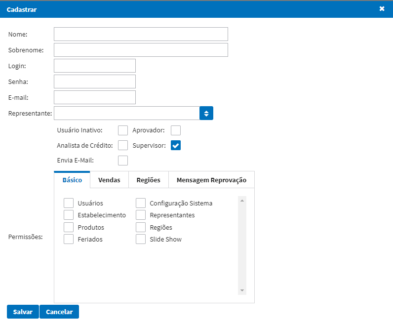
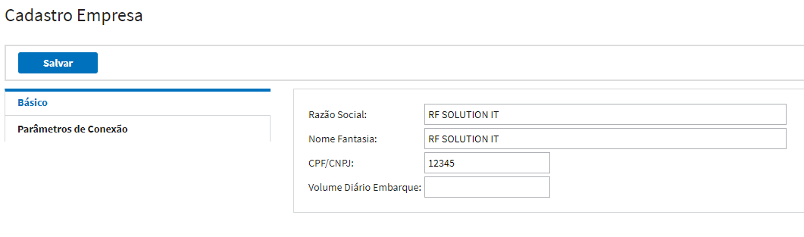
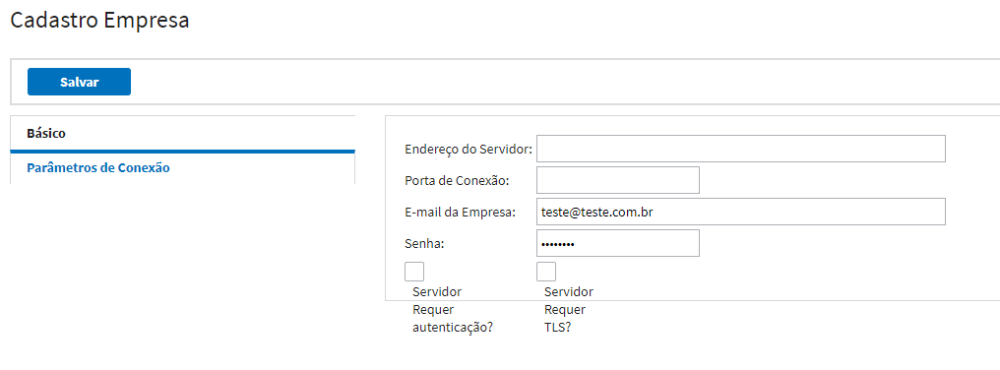
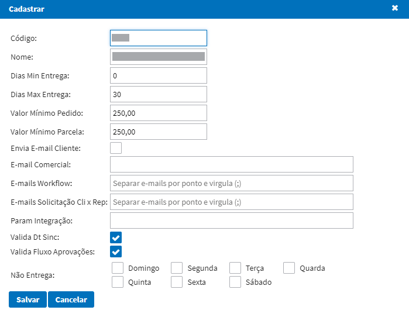
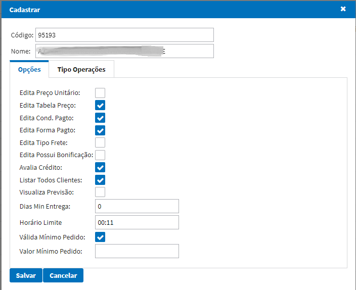
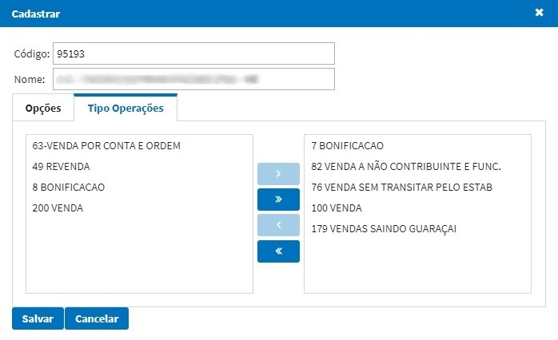
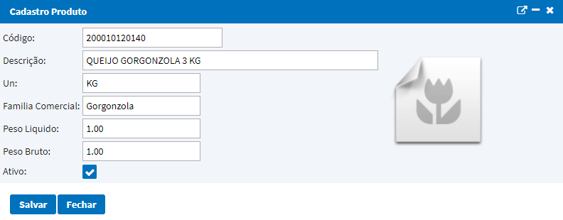
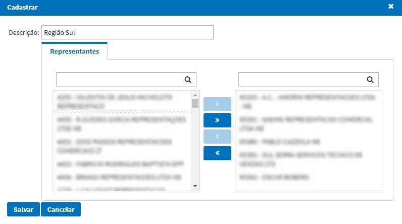
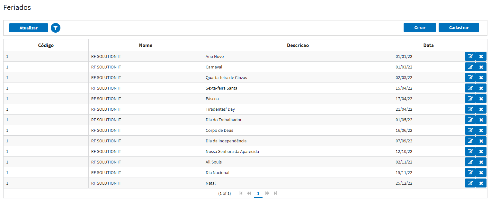
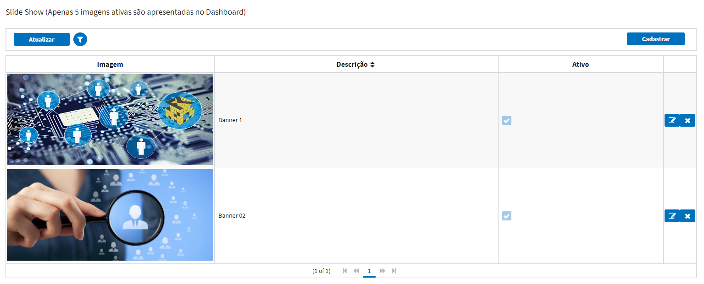

# Básico

## Usuários

Essa função tem como caracteristica cadastrar, alterar ou inativar usuários.

**Principais Campos e Parâmetros:**

* `Nome` - Permite inserir o nome do usuário.
* `Sobrenome` - Permite inserir o sobrenome do usuário.
* `Login` - Permite inserir o login do usuário.
* `Senha` - Permite inserir a senha do usuário.
* `E-mail` - Permite inserir o e-mail do usuário.
* `Representante` - Permite selecionar o representante vinculado ao usuário, para implantação de pedidos;
* `Usuário inativo` - Permite inativar o usuário.
* `Aprovador` - Permite marcar se o usuário é aprovador de cadastros de novos clientes.
* `Analista de Crédito` - Permite marcar se o usuário é analista de crédito para cadastro de novos clientes.
* `Supervisor` - Permite marcar se o usuário é um supervisor de vendas. Ao selecionar esta opção será possivel relacionar as regiões que o supervisor poderá consultar informações.
* `Envia E-Mail` - Permite marcar se o usuário envia e-mail automáticamente de pedidos de venda para os clientes, ou solicitação de cadastro de usuário.
* `Permissões` - Permite selecionar as permissões que o usuário possuirá. 

1. Permissões Cadastros Básico:
    - Usuários
    - Estabelecimento
    - Produtos
    - Feriados
    - Configuração Sistema
    - Representantes
    - Regiões
    - Slide Show
2. Permissões Vendas:
    - Cadastro Clietes
    - Digitação de Pedidos
    - Consulta Pedidos
    - Acompanhamento Metas
    - Consulta Notas Fiscais
    - Integrar Clientes
    - Consulta Clientes
    - Acompanhamento Vendas
    - Pendências Financeiras    
3. Permissões Regiões:
    - Na opção Regiões, possibilita o usuário selecionar as regiões que o usuário irá ter permissões.
4. Mensagem Reprovação:
    - Permite informar uma mensagem padrão para reprovação de clientes para ser enviada ao representante.

## Configuração Sistema

Cadastrar Informações da empresa e configuração de envio de e-mail do sistema.

**Parâmetros de Conexão**

* `Endereço do Servidor` - IP do servidor de envio de e-mail.
* `Porta de Conexão` - Porta do servidor de envio de e-mail.
* `E-mail da Empresa` - E-mail que será feito o envio. 
* `Senha` - Senha do e-mail parametrizado.
* `Servidor requer autenticação?` - Marcar o flag caso o servidor de e-mail for obrigatório autenticação.
* `Servidor requer TLS?` - Marcar o flag caso o servidor de e-mail utilizar TLS.

## Estabelecimento

Cadastro de estabelecimentos e parametrizações.

**Principais Campos e Parâmetros:**

* `Código` - Código do estabelecimento.
* `Nome` - Nome do estabelecimento.
* `Dias Min Entrega` - Número mínimo de dias para entrega.
* `Dias Max Entrega` - Número máximo de dias para entrega.
* `Valor Mínimo Pedido` - Valor total mínimo dos pedidos digitados.
* `Valor Mínimo Parcela` - Valor mínimo da parcela do pedido.
* `Envia E-mail Cliente` - Caso marcado, os clientes do sistema poderão receber e-mails de notificações de pedidos. 
* `E-mails Workflow` - E-mails da equipe do comercial da empresa, na qual receberão solicitações em sua caixa de e-mails, para liberação de clientes para os representantes no sistema. (Separado por ponto e vírgula, caso tiver mais de um)
* `E-mails Solicitação Cli x Rep` -  E-mails da equipe do comercial da empresa, na qual receberão solicitações em sua caixa de e-mails sobre solicitações de novos clientes para os representantes no sistema. (Separado por ponto e vírgula, caso tiver mais de um)
* `Param Integração` - Token de acesso para sistema externo. 
* `Valida Dt Sinc` - Caso marcado, o sistema irá validar a data de sincronização do pedido, não permitindo sincronizar pedidos com datas anteriores a atual.
* `Não Entrega` - Ao marcar o flag será restringido o dia da semana marcado para que o representante não consiga sincronizar o pedido em tal data de entrega no portal. 

## Representantes

Cadastro de representantes e parametrizações.

**Principais Campos e Parâmetros:**

* `Edita Preço Unitário` - Ao marcar o representante irá conseguir alterar o preço do item no momento da digitação do pedido.
* `Edita Tabela Preço` - Ao marcar o representante irá conseguir alterar qual tabela de preço ele quer usar para o pedido digitado.
* `Edita Cond. Pagto` - Ao marcar o representante irá conseguir alterar qual condição de pagamento ele quer usar para o pedido digitado.
* `Edita Forma Pagto` - Ao marcar o representante irá conseguir alterar qual forma de pagamento ele quer usar para o pedido digitado.
* `Edita Tipo Frete` - Ao marcar o representante irá conseguir alterar o tipo de frete do pedido digitado se será CIF ou FOB.

**Obs:** Caso desmarcado essas opções o pedido buscará as informações de acordo com o cliente selecionado na digitação do pedido.

Na aba **Tipo Operações** abaixo, o usuário conseguirá selecionar as operações permitidas para o representante digitar o pedido.  

## Produtos

Cadastro de produtos, é permitido anexar imagem do produto para o representante visualizar no momento da digitação.

Na a direita das informações do produto é permitido anexar uma imagem ao cadastro para facilitar a visualização no momento da digitação do pedido. 

## Regiões

Cadastro de regiões e relacionar representantes.

Informar uma descrição e relacionar a direita os representantes dessa região. Dessa forma o supervisor que terá permissão a essa região, irá conseguir visualizar as informações apenas desses representantes relacionados. 

## Feriados

Cadastro de feriados por estabelecimento.

O botão **Gerar** irá cadastrar automaticamente todos os principais feriados do ano. Já os feriados municipais\estaduais devem ser cadastrados manualmente. Esse cadastro será necessário para não interferir nas metas mensais dos representantes.

## Slide Show 

Cadastro de banners para visualização na tela inicial - Dashboard.

**Obs:** Recomendado utilizar imagens de 900 x 400 pixels.