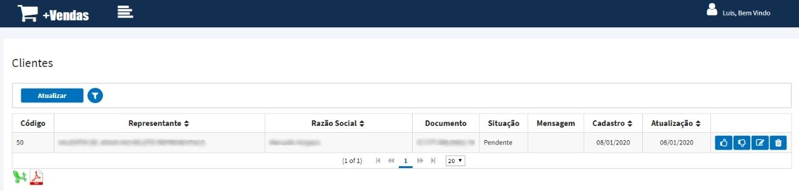

# Cadastros

## Cadastro Clientes

Cadastro feito para os pré-clientes, esses pré-clientes ficarão pendente de aprovação para o setor comercial da empresa, caso aprovado será liberado ao representante que fez seu cadastro implantar pedidos para esse novo cliente.

**Pontos Importantes**

* As pesquisas desses clientes nesta tela devem ser feitas apenas por CPF/CNPJ válidos.
* Caso for um cliente novo abrirá o formulário para digitação das informações.
* Se já existir o documento na base o usuário poderá realizar a alteração do cadastro do cliente.
* A digitação do número do documento realiza uma busca automática das informações do cliente na base da Receita Federal, caso encontrar algumas informações do cadastro virão preenchidas.
* A digitação do CEP realiza uma busca automática das informações de Estado, Cidade, Endereço, etc. Também disponível na aba Informações Cobrança e Informações Entrega. 

**Obs:** Caso um novo cliente for aprovado e ao digitar um pedido o mesmo não aparecer na lista, o representante deve acessar essa mesma tela e informar o documento do cliente. Irá aparecer uma mensagem de confirmação para o envio de uma solicitação via e-mail ao comercial da empresa, que realizará a liberação deste cliente.

## Integrar Clientes

Após feito o cadastro do pré-cliente, o mesmo aparecerá nesta tela para aprovação ou reprovação da equipe do comercial.

**Pontos Importantes**

* É obrigatório informar o Grupo do Cliente, Tabela de Preço e Condição de Pagamento antes da aprovação do cliente.
* Ao finalizar o processo é enviado um e-mail ao representante se o cliente foi ou não aprovado e o motivo da causa.