# Consultas

## Clientes

Lista de clientes por representante.

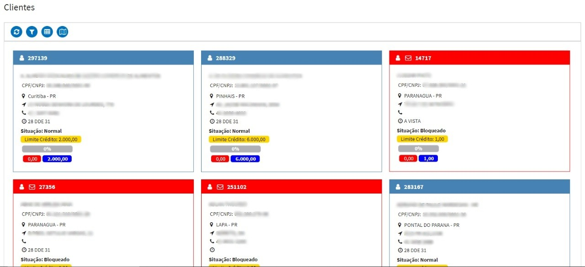

**Principais Opções**

* `Consultar Pedidos Cliente` - Permite visualizar somente os pedidos do cliente selecionado.
* `Solicitar Liberação Cliente Bloqueado` - Permite enviar um e-mail ao setor comercial para realizar a liberação de clientes suspensos ou bloqueados para faturamento. 
* `Mapa Atendimento` - Permite visualizar a localização dos clientes em um mapa.

## Pedidos

Lista de pedidos digitados, nesta tela não é permitido incluir e realizar alterações no pedido, somente consulta.

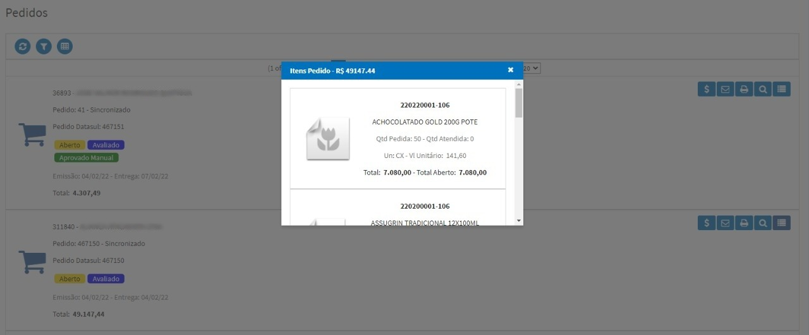

## Acompanhamento Vendas

Visualização de forma detalhada de todas as vendas implantadas no período. Permitindo visualizar valores por Tipo de Operação, Familia do item e por produto.

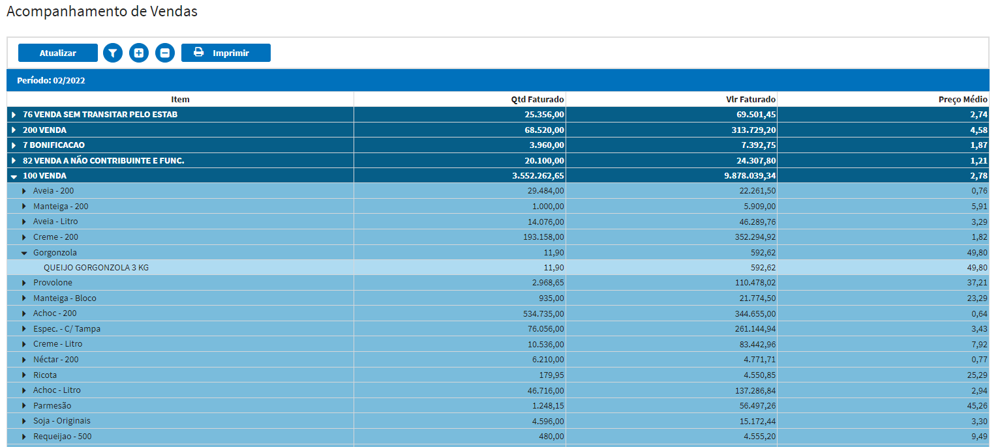

## Acompanhamento Metas

Visualização de forma detalhada das metas do representante no período. Permitindo visualizar valores por Familia do item, produto e para supervisores é permitido visuaizar por representante.

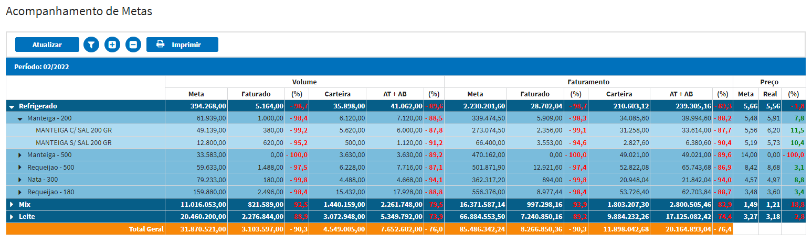

## Pendências Financeiras

Permite o representante visualizar as pendências financeiras de seus clientes. 

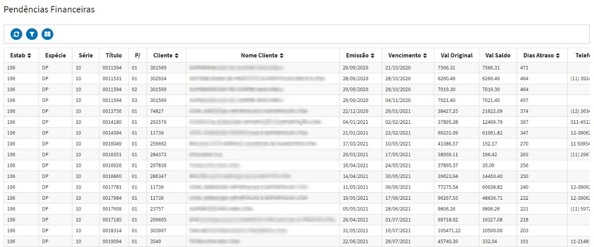

## Notas Fiscais

Permite o representante visualizar as notas fiscais faturadas de seus pedidos. 

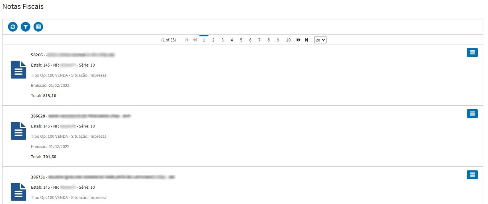

## Saldo Estoque

Permite o representante visualizar o saldo em estoque dos itens.

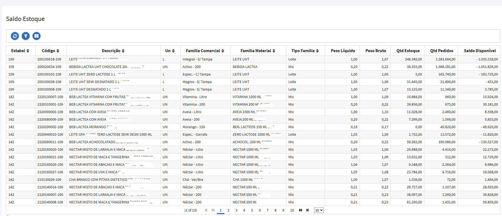

## Movimentos Conta Flex

Permite o representante visualizar os movimentos da sua conta flex.

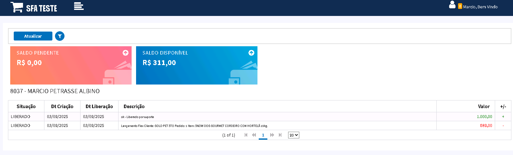

## Dashboard Cliente

Permite realizar um consulta detalhada das informações do cliente.

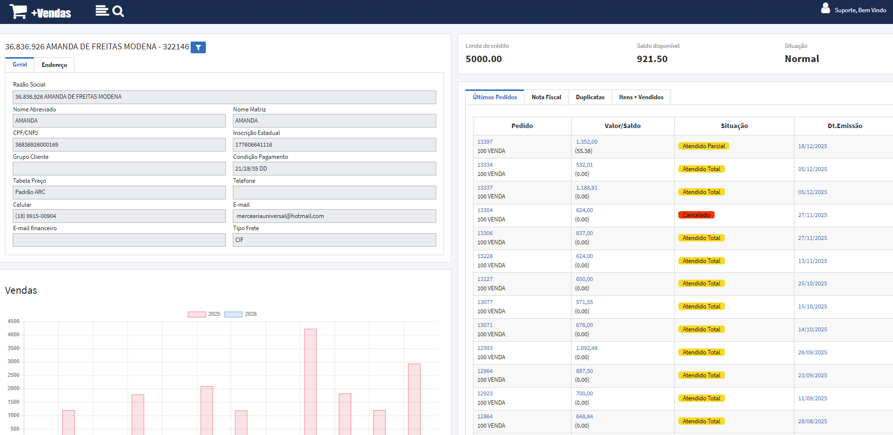

* `Ultimo Pedido:` Listagem dos pedidos do cliente;
* `Nota Fiscal:` Listagem das notas fiscais do cliente;
* `Duplicatas:` Listagem das duplicatas do cliente;
* `Itens + Vendido:` Listagem dos itens mais vendidos por quantidade;

## Pesquisa Global

Permite realizar pesquisas globais no portal.

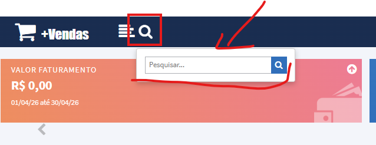

Neste campo o usuário poderá informar uma pesquisa de clientes ou pedidos, podendo informar apenas qualquer informação, tais como:

* CNPJ/CPF do cliente;
* Razão Social do cliente;
* Código do Cliente
* Numero do pedido do Cliente;

Abaixo o resultado a partir da informação pesquisada:

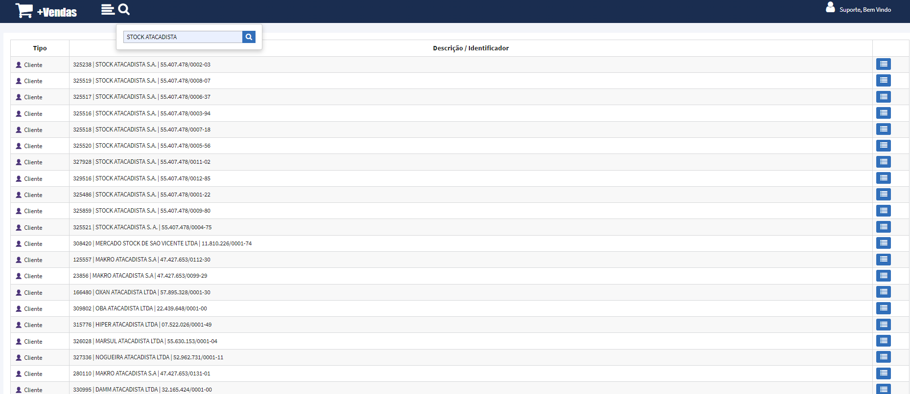

Ao clicar no botão do resulta, será possivel realizar um detalhamento do cliente ou pedido:

* Detalhamento cliente:

* Detalhamento Pedido:
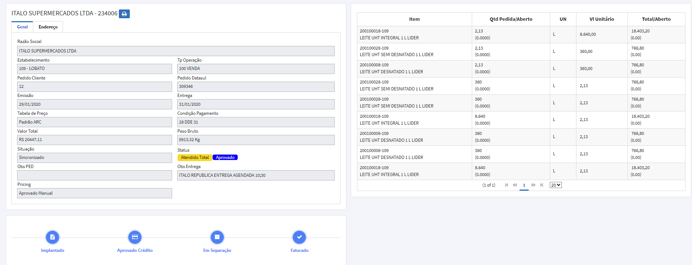

