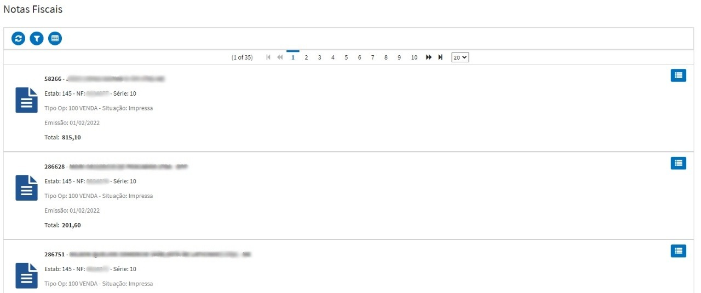

# Consultas

## Clientes

Lista de clientes por representante.

**Principais Opções**

* `Consultar Pedidos Cliente` - Permite visualizar somente os pedidos do cliente selecionado.
* `Solicitar Liberação Cliente Bloqueado` - Permite enviar um e-mail ao setor comercial para realizar a liberação de clientes suspensos ou bloqueados para faturamento. 
* `Mapa Atendimento` - Permite visualizar a localização dos clientes em um mapa.

## Pedidos

Lista de pedidos digitados, nesta tela não é permitido incluir e realizar alterações no pedido, somente consulta.

## Acompanhamento Vendas

Visualização de forma detalhada de todas as vendas implantadas no período. Permitindo visualizar valores por Tipo de Operação, Familia do item e por produto.

## Acompanhamento Metas

Visualização de forma detalhada das metas do representante no período. Permitindo visualizar valores por Familia do item, produto e para supervisores é permitido visuaizar por representante.

## Pendências Financeiras

Permite o representante visualizar as pendências financeiras de seus clientes. 

## Notas Fiscais

Permite o representante visualizar as notas fiscais faturadas de seus pedidos. 

