# Alterações

Alterações técnicas, inovação e manutenção de rotinas do sistema SFA.

## Versão 1.0.4

### Parâmetro dias minimos cancelamento

Disponibilizado parâmetro nas configurações do sistema, para informar o prazo minímo permitido para cancelamento de pedidos no sistema Datasul.

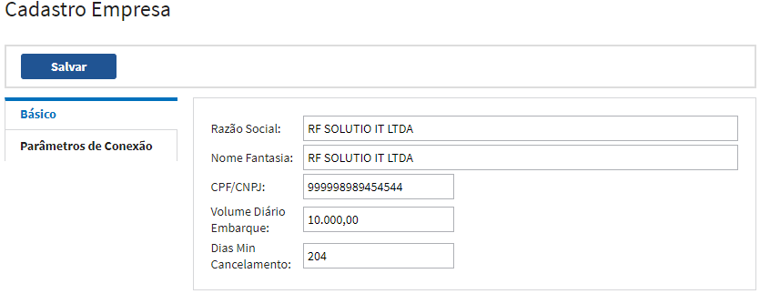

### Cancelar Pedidos

No menu tarefas, foi disponibilizado uma opção para que o usuário possa solicitar o cancelamento de pedido no ERP.

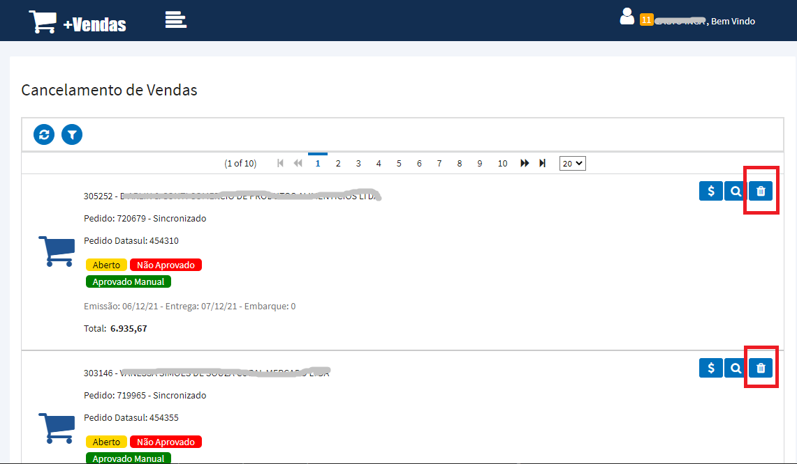

* É necessário realizar a liberação de permissão para o usuário;
* Só será permitido realizar cancelamento de pedidos "Abertos" no ERP;

## Versão 1.0.3

### Tipo Visualização Itens
Nova opção para que o representante possa escolher a forma de visualização dos itens durante a digitação de pedidos.

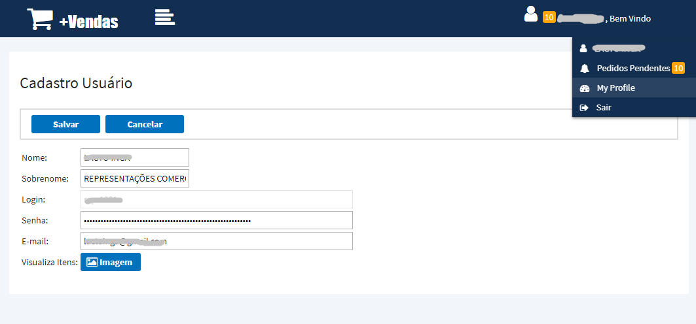

**Opções**

* `Imagem` - Visualização da lista de itens com as imagens cadastradas.
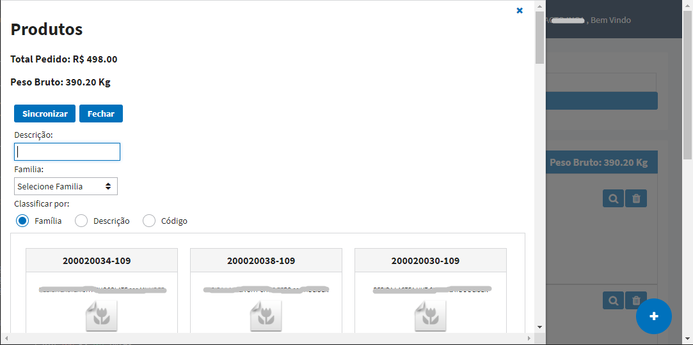

* `Lista` - Visualização na forma de listagem dos itens. 
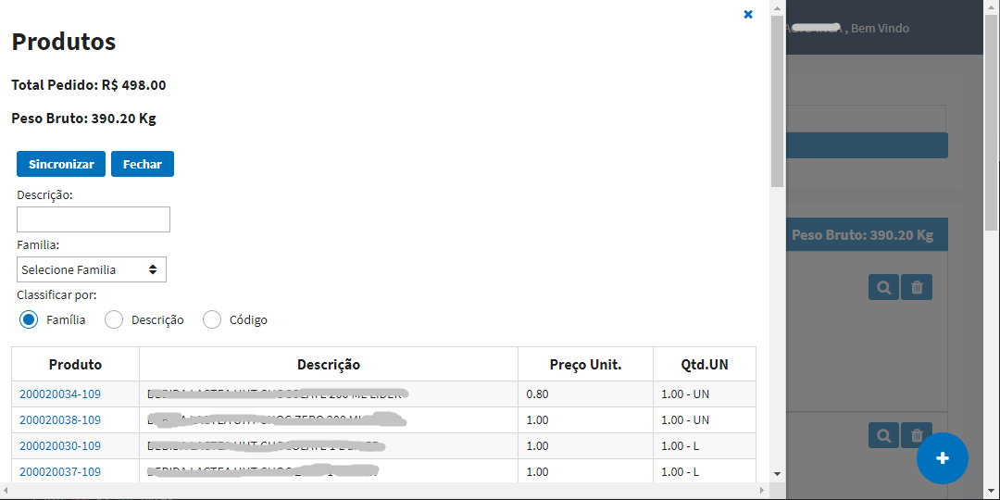

### Desconto Por Familia
Foi disponibilizado um novo botão onde é possivel visualizar o total de itens digitado por familia comercial.
Nesta opção também poderá ser aplicado um desconto de adordo com os seguintes critérios: Cliente, Familia Comercial, Quantidade Miníma e percentual de desconto.

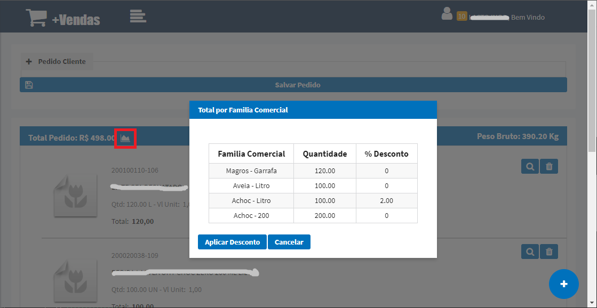

**ATENÇÃO:** Caso seja aplicado o desconto e posteriormente o usuário exclua algum item, os descontos por familia, serão desfeitos e o usuário deverá realizar o procedimento de desoncto novamente.

## Versão 1.0.2
---
### Clientes Atendidos
Nova tela para visualizar os clientes que tiveram vendas nos últimos 30 dias, +30 dias e que não tiveram vendas.

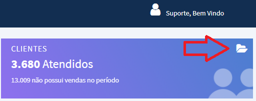

Nesta tela é possível verificar a data da última venda de cada cliente, como também é possível verificar a localização de cada cliente no mapa.

### Alteração de Senha

Nova opção para alterar senha pelo sistema.

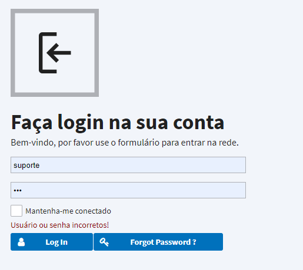

Ao clicar na opção “Forgot Password” será necessário informar seu login ou e-mail cadastrados no sistema para recuperação da senha.

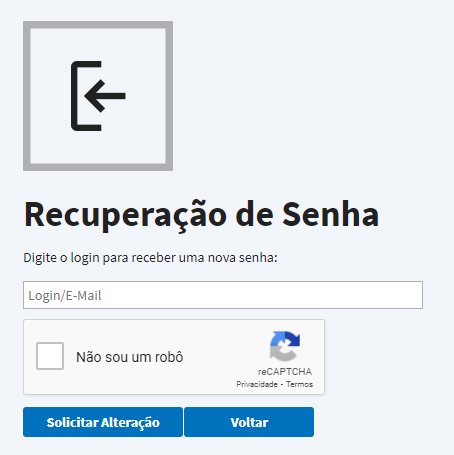

A seguir, o usuário irá receber um e-mail para confirmação da alteração de senha, sendo necessário clicar no link disponível neste que irá direciona-lo novamente para o sistema, onde permitirá a criação de uma nova senha.

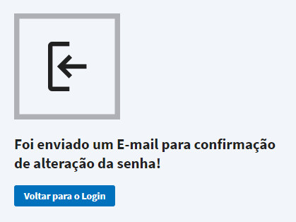

Criar nova senha e repeti-la.

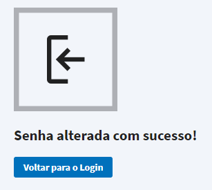

### Editar Tipo de Frete

Nova opção disponível para os usuários supervisores onde é possível definir se o representante irá utilizar a função de edição do tipo de frete CIF/FOB na digitação do pedido. Caso não marcado, o tipo de frete será de acordo com a parametrização do cliente selecionado na digitação do pedido, não permitindo realizar a alteração.

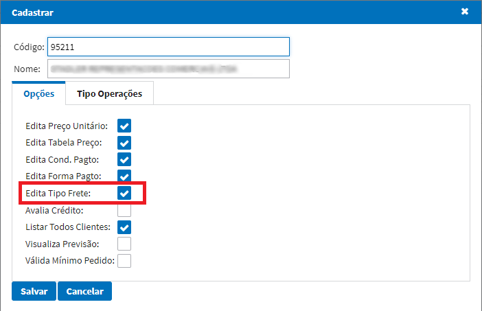

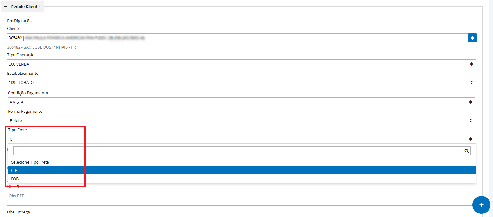

### Dias Minímo Entrega

Nesta opção o usário poderá parametrizar os dias minímo de entrega por representate e estabelecer um horario limite. Caso o pedido seja implantado após o horário limite, será incrementado mais um dia na data de entrega.

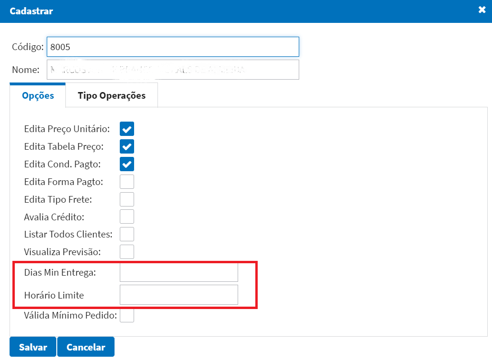

### Apresentação de Banners

Desenvolvido tela para cadastrar banners para apresentação na tela inicial do portal de vendas.

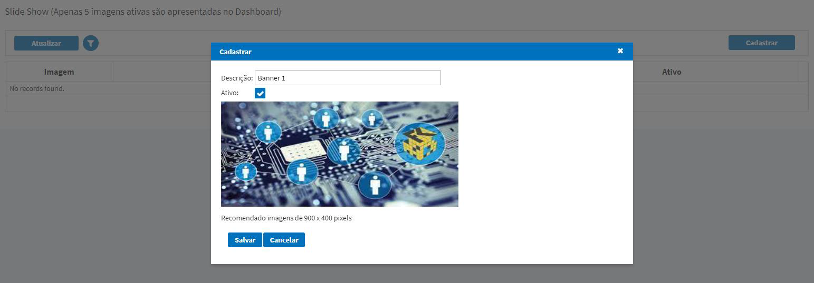

É possível cadastrar até 5 banners para apresentação no Dashboard.

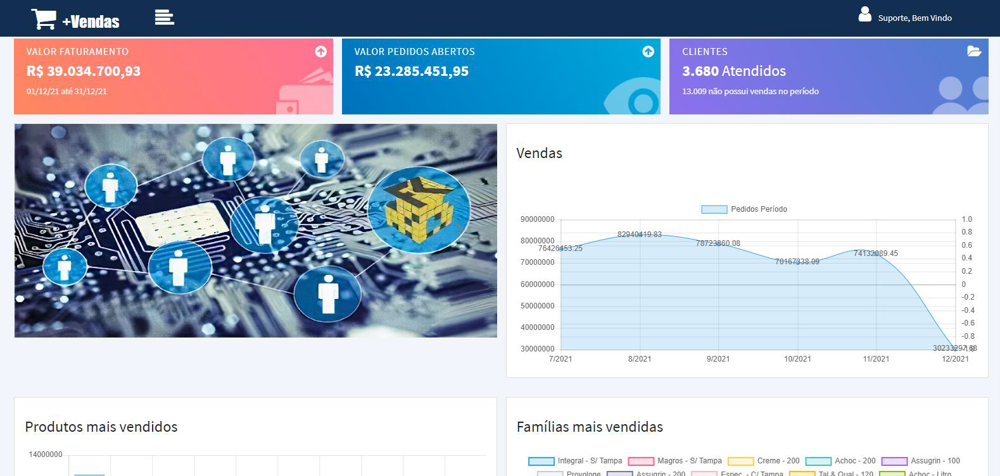

Utilizar imagens do tamanho recomendável (900x400 pixels) para melhor visualização.

### Referências comerciais/bancárias

Junto ao cadastro de pré-cliente, foi acrescentado uma nova aba para o representante digitar as refêrencias bancárias e/ou comerciais do cliente. 

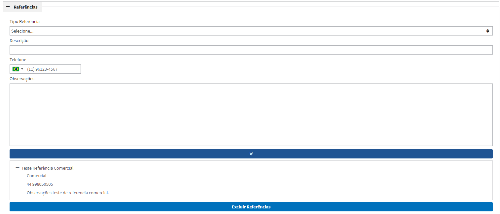

### Anexar arquivos 

Estará disponível para o representante anexar arquivos ao cadastro do pré-cliente. 

Exemplos: imagens (jpg, jpeg, png), pdf, word, txt, rar, etc. 

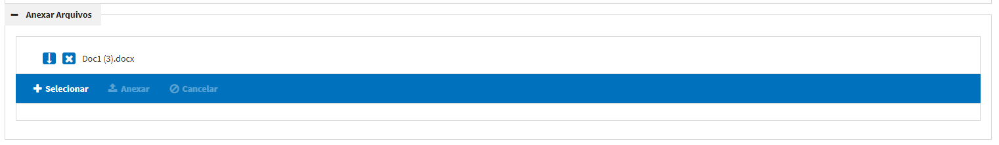

Após concluído o cadastro, o setor comercial irá conseguir realizar o download desses arquivos para conferência, tela de integração de clientes. 

### Consulta detalhada pré-cliente

Na tela de consulta clientes, foi disponibilizado uma opção para consultar a ficha do pré-cliente de forma detalhada no sistema. 

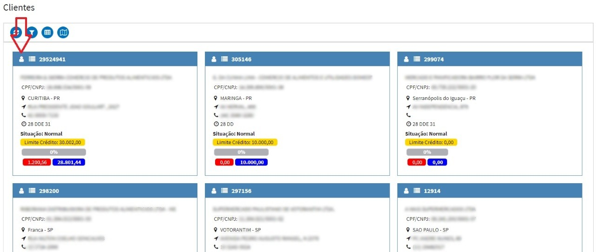

Caso o cliente não possuir uma ficha no sistema, irá detalhar as informações base do cadastro do cliente. 

**Obs:** O botão a esquerda destacado na imagem acima, listava todos os pedidos do cliente, essa funcionalidade será feita pelo botão a direita. 

## Versão 1.0.1
---
### Cadastro de Regiões
Desenvolvimento do cadastro de regiões.

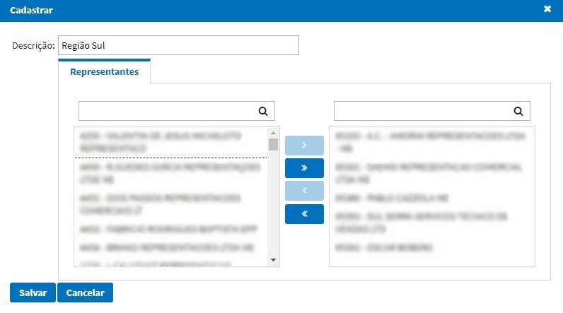

Neste cadastro será necessário informar uma descrição para a região conforme exemplo acima e vincular todos os representantes pertencentes a essa região.

### Cadastro de Usuário (Supervisor) / Feriados

Desenvolvimento do cadastro de usuário como supervisor de regiões.

Para que o usuário supervisor consiga realizar as consultas corretamente no portal, é necessário marcar a opção Supervisor e vincular as regiões ao seu cadastro (permitido mais de uma região). O supervisor conseguirá realizar o acompanhamento das vendas e metas de todos os representantes vinculados a essas regiões que foi concedido acesso.

Na mesma tela foi incluído o flag “Envia E-mail”, este será utilizado para os Representantes, caso marcado este flag o representante irá receber em seu e-mail todos os dias um relatório de meta diário. Também relacionado com este relatório de metas foi desenvolvido o Cadastro de Feriado:

O botão Gerar irá cadastrar automaticamente todos os principais feriados do ano. Já os feriados municipais\estaduais devem ser cadastrados manualmente. Esse cadastro será necessário para não interferir nas metas mensais dos representantes.

### Acompanhamento Tela Inicial

Na tela inicial quando acessado por um usuário supervisor será mostrado o resultado de TODOS OS REPRESENTANTES vinculados as regiões.

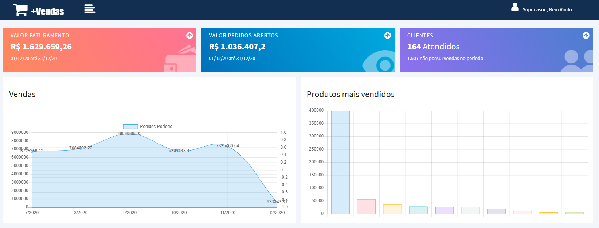

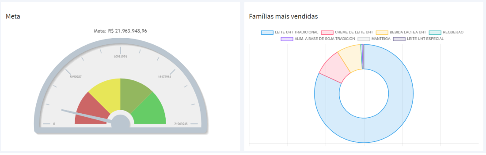

Também será permitido filtrar os resultados por período e por representante, pelo botão localizado no canto inferior esquerdo da tela.

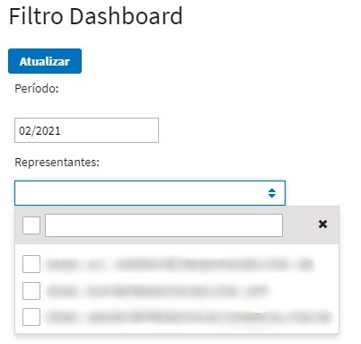

### Acompanhamento de Metas

O acompanhamento de metas será disponível tanto para os Representantes, quanto para os Supervisores.

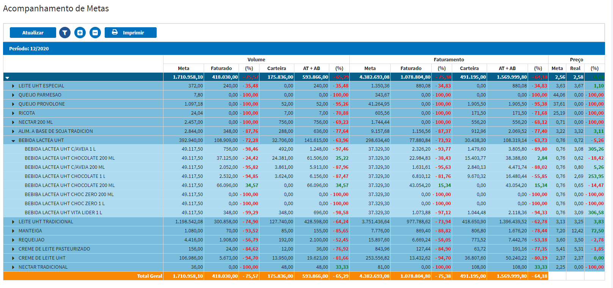

Será permitido realizar o acompanhamento de metas sobre o Volume / Faturamento / Preço dos produtos e famílias vinculadas ao representante.

A tela também permite realizar o filtro por período. No caso dos supervisores, pode-se também realizar um filtro por representantes.

O botão Imprimir irá gerar o relatório detalhado das metas de acordo com o filtro selecionado no momento. Segue exemplo abaixo:

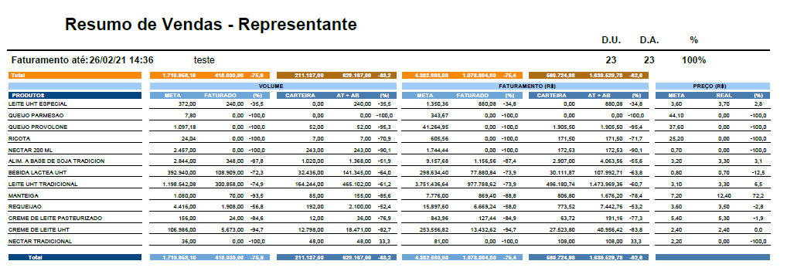

### Notificações de Pedidos Pendentes

Afim de alertarmos os representantes, foi desenvolvido no canto superior direito da tela um alerta de notificação para pedidos que ficaram Em Digitação ou com Erro de Sincronização.

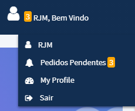

Ao clicar na opção será direcionado para uma tela contendo somente os pedidos que estão pendentes para o representante, conforme abaixo:

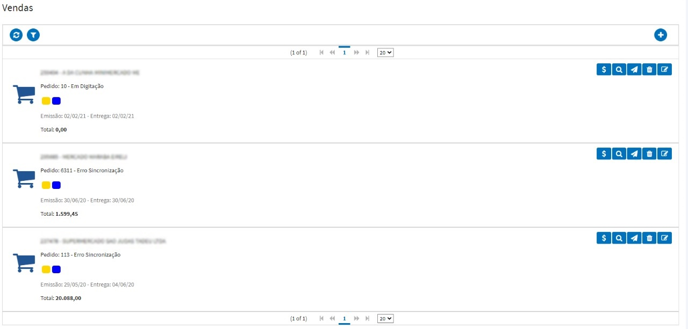

### Parametrização Dias Não Entrega

Será permitido restringir dias da semana para que o representante não consiga sincronizar o pedido em tal data de entrega no portal. Essa restrição é feita no cadastro de estabelecimento, conforme tela abaixo:

### Relacionamento Representante x Tipo Operação

Conforme solicitação do setor Comercial, a partir de março/2021 os representantes não irão poder incluir pedidos de bonificação no portal. Com o intuito de deixarmos esse processo flexível, criamos um relacionamento de Representantes x Tipo Operação, no cadastro do representante dentro do SFA, conforme exemplo abaixo:

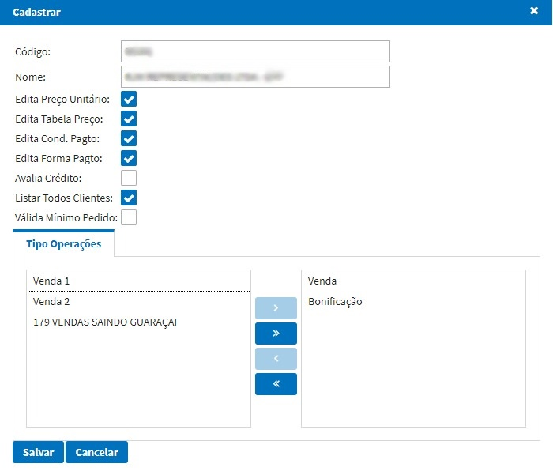

Será necessário arrastar para a direita os tipos de operação que o representante poderá ter acesso na implantação de pedidos no portal.

**ATENÇÃO:** Para os NOVOS representantes deve ser feito esse procedimento manual dentro do SFA, pois o mesmo é criado sem ter acesso a nenhum tipo de operação.