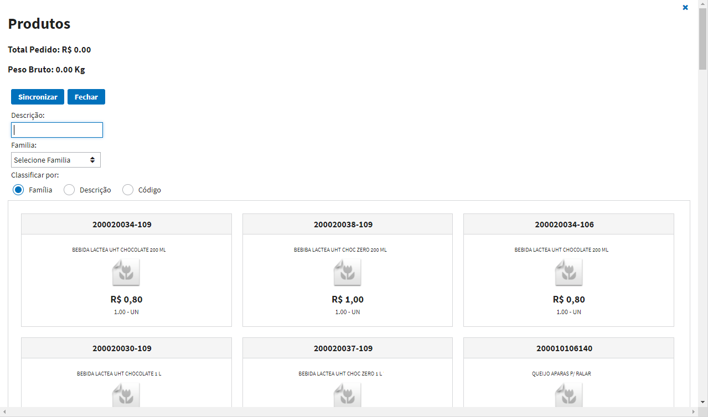
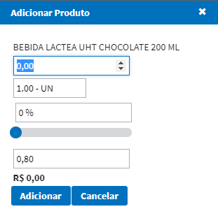
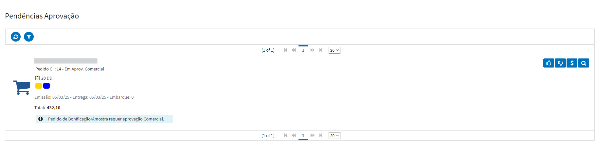

# Tarefas

## Digitação de Pedidos

Tela principal, lista de pedidos digitados.

**Principais Opções**

* `Novo Pedido` - Permite digitar um novo pedido. 
* `Totais do Pedido` - Permite visualizar valor total em aberto, valor liquído do pedido e valor total do pedido.
* `Envia E-mail Cliente` - Envia um e-mail de confirmação do pedido ao cliente. 
* `Imprimir Pedido` - Imprime um resumo do pedido com todos os detalhes e itens.
* `Detalhar Pedido` - Permite visualizar as principais informações do pedido.
* `Editar Pedido` - Permite alterar o pedido caso ele ainda não foi sincronizado.

**Digitar Novo Pedido**

Preencher todas as informações do pedido.

Após preenchido as informações base do pedido, o representante deve salvar o pedido para habilitar a opção de incluir os produtos ao pedido.

**Opções disponíveis para digitação dos pedidos**

Ao adicionar os produtos, abrirá uma lista com todos os itens da tabela de preço: 

Ao clicar sobre a imagem abrirá uma tela para o representante informar a quantidade do produto que será vendido e o sistema calculará o valor total automaticamente.

Ao terminar de incluir os itens do pedido, o representante deve sincronizar o pedido na qual será disponibilizado para o comercial faturar. 

## Pendências Aprovação

Tela de pendências de aprovação, lista de pedidos pendentes de aprovação.

Usuário aprovador pode visualizar os pedidos pendentes de aprovação, aprovar ou rejeitar o pedido, caso faça parte do grupo de aprovação.de aprovação.