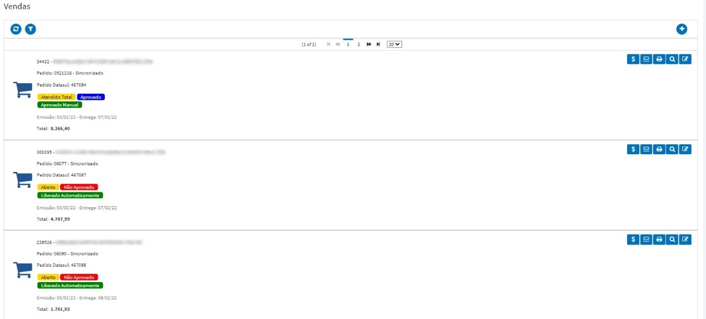
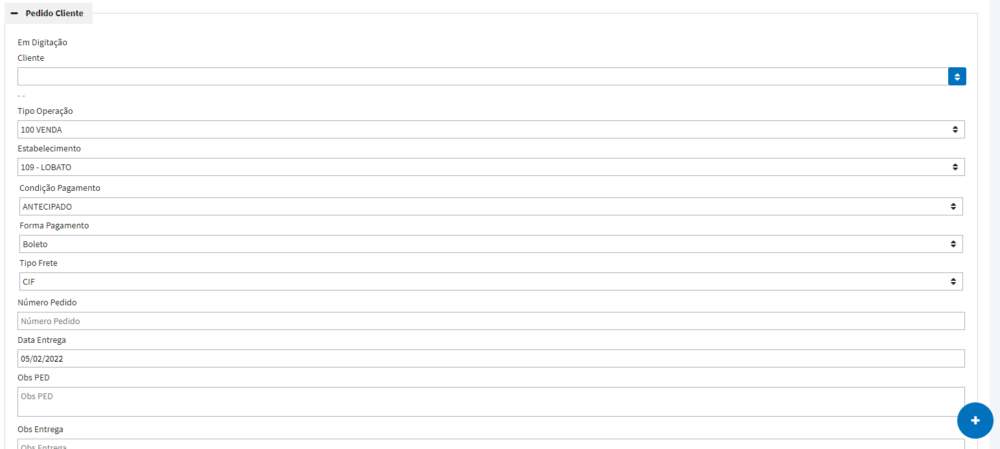
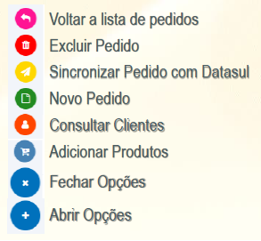
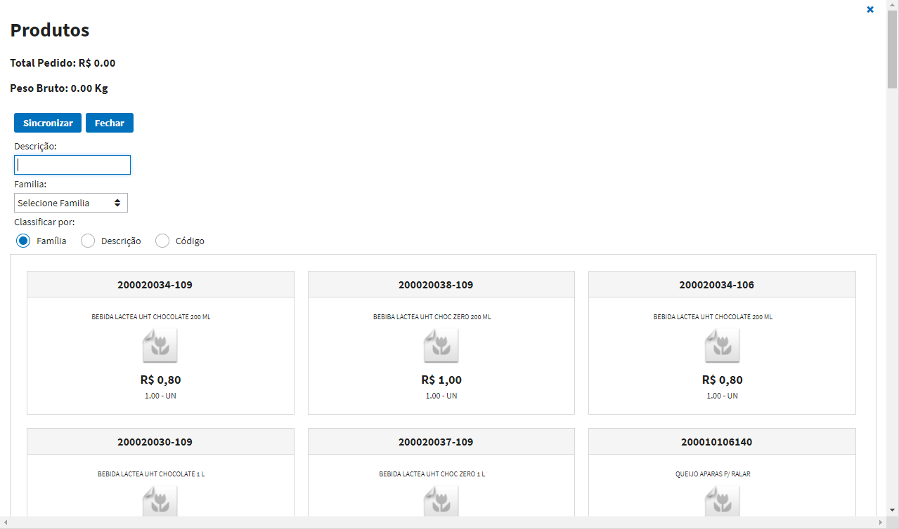
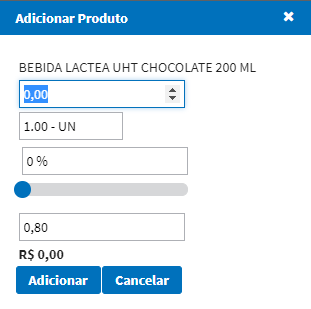
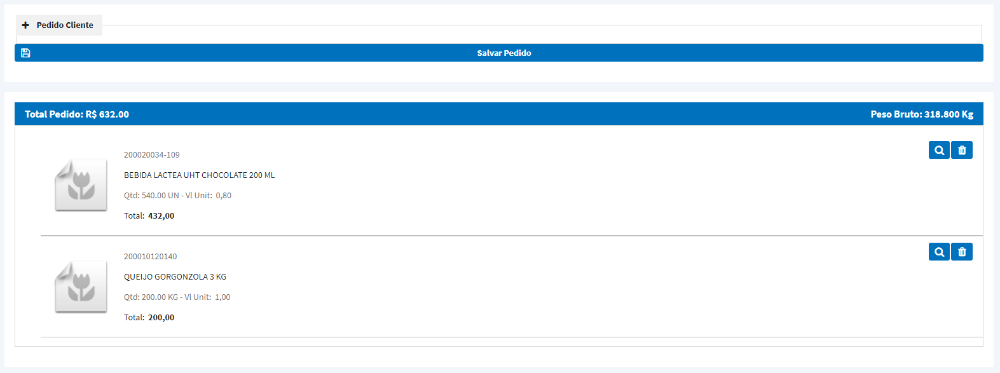
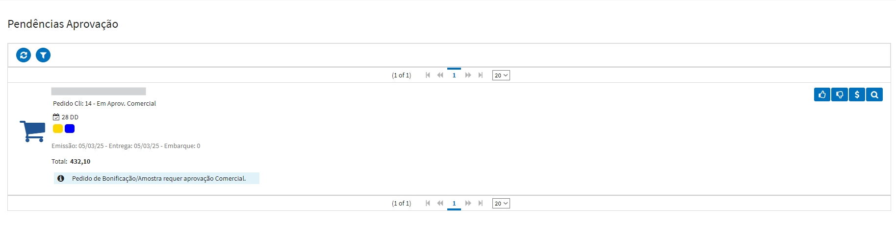
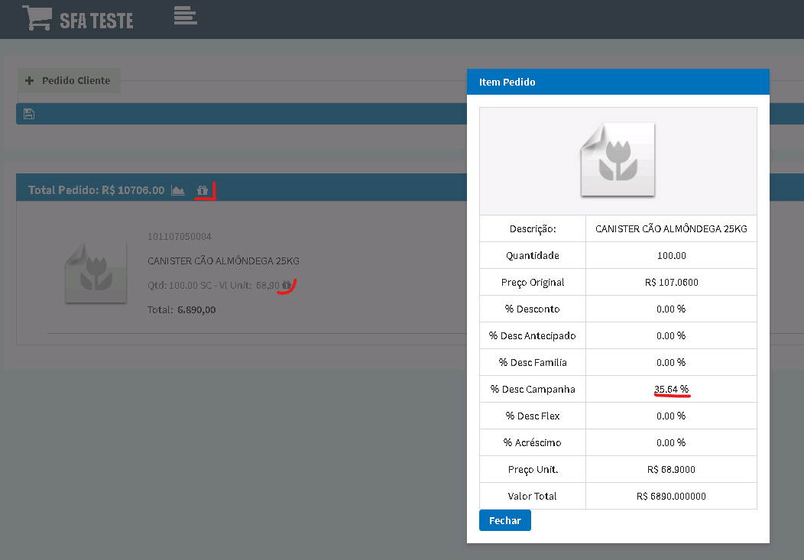
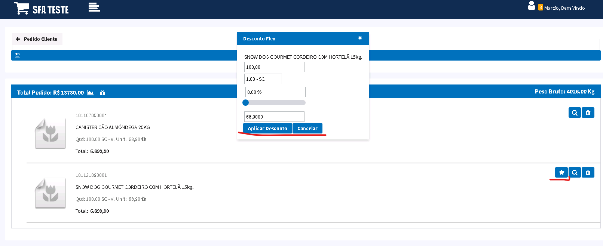

# Tarefas

## Digitação de Pedidos

Tela principal, lista de pedidos digitados.

**Principais Opções**

* `Novo Pedido` - Permite digitar um novo pedido. 
* `Totais do Pedido` - Permite visualizar valor total em aberto, valor liquído do pedido e valor total do pedido.
* `Envia E-mail Cliente` - Envia um e-mail de confirmação do pedido ao cliente. 
* `Imprimir Pedido` - Imprime um resumo do pedido com todos os detalhes e itens.
* `Detalhar Pedido` - Permite visualizar as principais informações do pedido.
* `Editar Pedido` - Permite alterar o pedido caso ele ainda não foi sincronizado.

**Digitar Novo Pedido**

Preencher todas as informações do pedido.

Após preenchido as informações base do pedido, o representante deve salvar o pedido para habilitar a opção de incluir os produtos ao pedido.

**Opções disponíveis para digitação dos pedidos**

Ao adicionar os produtos, abrirá uma lista com todos os itens da tabela de preço: 

Ao clicar sobre a imagem abrirá uma tela para o representante informar a quantidade do produto que será vendido e o sistema calculará o valor total automaticamente.

Ao terminar de incluir os itens do pedido, o representante deve sincronizar o pedido na qual será disponibilizado para o comercial faturar. 

## Pendências Aprovação

Tela de pendências de aprovação, lista de pedidos pendentes de aprovação.

Usuário aprovador pode visualizar os pedidos pendentes de aprovação, aprovar ou rejeitar o pedido, caso faça parte do grupo de aprovação.de aprovação.

## Aplicar Campanhas Pedido

Na opção demarcada abaixo, é possivel realizar a verificação dos itens que possuem campanhas ativas que possam ser aplicadas as pedido de venda:

Após clicar no botão para aplicar campanhas, será apresentado um icone demonstrando os itens que foram gerados campanha.

Na janela ao lado, no detalhamento do item, também será possivel verificar de forma detalhada qual tipo de desoncto foi aplicado para o item.

* Para campanhas de bonificação, será gerado um pedido de bonificação após a sincronização do pedido de venda principal.

## Aplicar Desconto Flex

Na opção indicada abaixo, indica que o item possui permissão para implantar desconto Flex. Ao clicar nesse botão será aberto uma janela que possibilitara ao vendedor informar um desconto flex para o item.

* O desconto flex só será permitido caso o representante possua saldo Flex Disponível.

Quando o profissional realiza a venda de um produto utilizando um preço de venda superior ao preço de tabela, é gerado no SFA um lançamento positivo (crédito) na sua conta corrente, que inicialmente não estará liberado para utilização. O processamento e liberação desse crédito somente será realizado quando o pedido exportado ao ERP retornar ao SFA com a informação de faturamento dos itens do pedido, onde a liberação do crédito será proporcional a quantidade faturada do item que a gerou. Caso o item gerador do crédito tenha sofrido corte integral do pedido, o crédito será cancelado. 
Quando o profissional realiza a venda de um produto utilizando um preço de venda inferior ao preço de tabela, é gerado no SFA um lançamento negativo (débito) na sua conta corrente, que é processado no momento da realização da venda no SFA, consumindo imediatamente o valor do saldo do Representante. 
O cálculo do valor do flex é composto conforme fórmula abaixo: 
valor_flex_produto = (preço de venda – preço tabela) x quantidade vendida 

Exemplo: 
O vendedor Emerson tem saldo flex igual a R$100,00 e realizou a seguinte venda:

|Produto   |Qtde Venda |Preço Tab |Preço Venda |Total    |Lancto Conta Flex
|:-------- |---------: |--------: |----------: |-------: |----------------:
|Produto A |    	10 |  R$10,00 |	    R$8,00 | R$80,00 |         -R$20,00
|Produto B |        20 |  R$15,00 |    R$18,00 |R$360,00 |         +R$60,00
